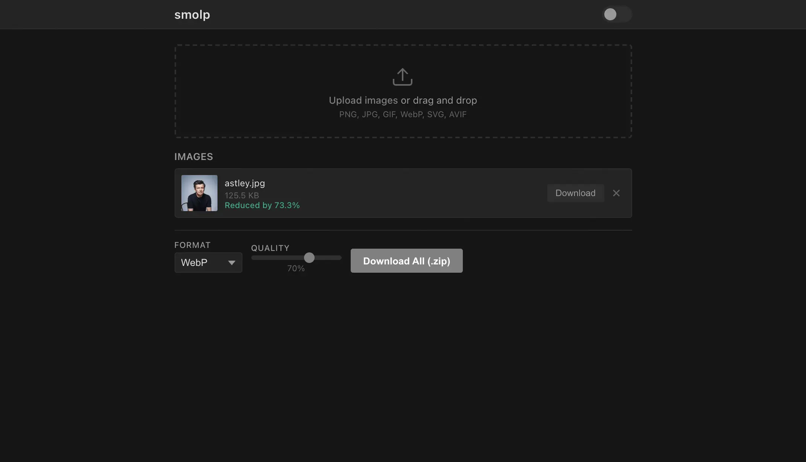

# smolp

<p align="center"></p>

Optimize images in your browser. Everything happens locally and your files never leave your device.

## How it works

Upload images by dragging or clicking. Choose a format (JPEG, PNG, WebP, AVIF) and quality. Process them and download individually or as a ZIP.

- **All local**: Canvas API, no uploads
- **Batch processing**: optimize multiple images at once

## Run

```bash
node server.js
```

Open `http://localhost:3000`.

## Docker

```bash
docker compose up -d
```

The image is published to `ghcr.io/lklynet/smolp` on push to `main`.

```bash
docker pull ghcr.io/lklynet/smolp:latest
docker run -d -p 3000:3000 ghcr.io/lklynet/smolp:latest
```

## Stack

- Vanilla JavaScript frontend, no framework
- Node.js HTTP server, no dependencies
- Canvas API for image processing
- JSZip for bulk downloads
- ~3 KB of handwritten CSS
- Minimal Docker image (Alpine)

## License

MIT
